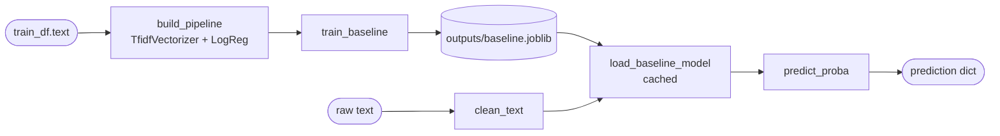
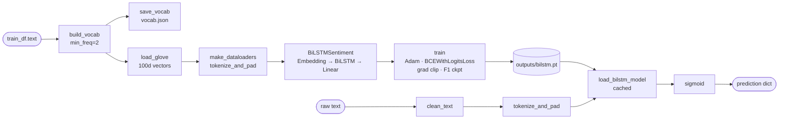
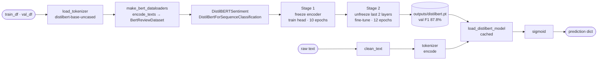

# ReviewPulse — Architecture

> Written for a new contributor. Describes where each concern lives today and names the intended boundaries for the v2.x refactor series.

---

## 1. Repository Layout

```
review-pulse/
├── app.py                  ← Streamlit UI (layout + input + result display only)
├── src/
│   ├── config.py           ← single source of truth: paths, model name constants, threshold
│   ├── app_service.py      ← cached model loaders + DistilBERT availability helpers for app.py
│   ├── parser.py           ← raw data → DataFrame
│   ├── preprocess.py       ← cleaning, auditing, splitting
│   ├── dataset.py          ← vocab, GloVe loader, PyTorch Dataset + DataLoaders
│   ├── features.py         ← EDA helpers (balance, length stats, plots)
│   ├── baseline.py         ← TF-IDF + LogReg: train, evaluate, load
│   ├── model.py            ← BiLSTMSentiment nn.Module
│   ├── train.py            ← BiLSTM training loop + checkpointing
│   ├── model_bert.py       ← DistilBERTSentiment nn.Module (HF wrapper)
│   ├── dataset_bert.py     ← DistilBERT tokenizer, BertReviewDataset, DataLoader factories
│   ├── checkpoint_bert.py  ← DistilBERT checkpoint serialization and bundle loading
│   ├── train_bert.py       ← DistilBERT training loop + stage orchestration
│   ├── evaluate.py         ← batch evaluation: metrics, confusion matrix, error analysis
│   ├── inference.py        ← single-text prediction; module-level model caching
│   └── utils/
│       └── samples.py      ← demo review samples for Streamlit app
├── outputs/                ← committed model artifacts + generated evaluation reports (PNG/CSV gitignored)
│   ├── baseline.joblib     ← trained TF-IDF + LogReg pipeline
│   ├── vocab.json          ← BiLSTM vocabulary
│   ├── bilstm.pt           ← BiLSTM checkpoint (epoch 9, val F1 84.0%)
│   └── distilbert.pt       ← DistilBERT compact checkpoint (epoch 12, val F1 87.8%)
├── data/                   ← raw Blitzer et al. 2007 review files (not in git)
│   ├── books/
│   ├── dvd/
│   ├── electronics/
│   └── kitchen_&_housewares/
├── embeddings/             ← GloVe vectors (not in git, ~800 MB)
├── tests/                  ← 189 fast tests + 5 slow integration tests
└── docs/                   ← project documentation
```

---

## 2. Four Distinct Concerns

The codebase has four roles that must stay separate. Conflating them is the primary source of complexity today.

| Role | What it does | Entrypoint |
|---|---|---|
| **Training** | reads raw data, fits a model, writes an artifact to `outputs/` | `python -m src.baseline`, `python -m src.train`, `python -m src.train_bert` |
| **Inference** | loads a cached artifact, cleans one text string, returns a prediction dict | `src.inference.predict_sentiment(text, model_name)` |
| **Evaluation** | loads artifacts + held-out data, computes batch metrics, writes reports | `python -m src.evaluate` |
| **App** | UI only — calls inference, renders results | `streamlit run app.py` |

The app **never** trains. Evaluation **never** writes model artifacts. Inference **never** reads raw data.

---

## 3. Data Flow

### 3.1 Shared preprocessing (all three models)

```
data/{domain}/positive.review
data/{domain}/negative.review
        │
        ▼
src/parser.py
  parse_review_file()      — BeautifulSoup pseudo-XML → list[dict]
  load_all_domains()       — iterates 4 domains → pd.DataFrame (8,000 rows)
        │
        ▼
src/preprocess.py
  audit_labels()           — flag is_ambiguous, rating_conflict
  drop_ambiguous()         — remove 3-star rows (0 dropped on this dataset)
  clean_text()             — lowercase, strip HTML, expand negations, remove punctuation
  remove_outliers()        — drop < 10 or > 500 words (279 dropped)
  split_data()             — stratified 70/15/15, seed=42
        │
        ▼
  train_df (5,404) · val_df (1,158) · test_df (1,159)
```

### 3.2 Baseline — TF-IDF + Logistic Regression

```
Training:
  train_df.text
        │
        ▼
  src/baseline.py
    build_pipeline()       — TfidfVectorizer(ngram_range=(1,2)) + LogisticRegression
    train_baseline()       — fits pipeline, saves → outputs/baseline.joblib
        │
        ▼
  outputs/baseline.joblib

Inference (one text):
  src/inference.py
    load_baseline_model()  — joblib.load, cached in _baseline_cache
    predict_baseline()     — clean_text → pipeline.predict_proba → dict
```



### 3.3 BiLSTM + GloVe

```
Training:
  train_df.text
        │
        ▼
  src/dataset.py
    build_vocab()          — token counts from train_df only (no leakage), min_freq=2
    save_vocab()           — outputs/vocab.json
    load_glove()           — maps vocab → 100d vectors (97.4% coverage)
    make_dataloaders()     — tokenize_and_pad (max_len=256), ReviewDataset, DataLoader
        │
        ▼
  src/model.py
    BiLSTMSentiment        — Embedding(15,924 × 100d) → Dropout → BiLSTM(256, 2, bidir)
                             → concat fwd+bwd hidden (512d) → Dropout → Linear(512→1)
        │
        ▼
  src/train.py
    train()                — Adam(lr=1e-3), BCEWithLogitsLoss, grad clip(5.0)
                             10 epochs, checkpoint by val F1
                             saves → outputs/bilstm.pt  (epoch 9, val F1 84.0%)

Inference (one text):
  src/inference.py
    load_bilstm_model()    — load_checkpoint + load_vocab, cached in _bilstm_cache
    predict_bilstm()       — clean_text → tokenize_and_pad → model → sigmoid → dict
```



### 3.4 DistilBERT (Hugging Face)

```
Training:
  train_df, val_df
        │
        ▼
  src/train_bert.py
    load_tokenizer()       — AutoTokenizer.from_pretrained("distilbert-base-uncased")
    make_bert_dataloaders()— encode_texts → BertReviewDataset → DataLoader

  src/model_bert.py
    DistilBERTSentiment    — DistilBertForSequenceClassification(num_labels=1)
                             + optional encoder freeze

  src/train_bert.py
    train_bert()           — Stage 1: freeze encoder, train head (head_epochs=10)
                             Stage 2: unfreeze last 2 layers, fine-tune (epochs=12)
                             Adam(head_lr=1e-4 / encoder_lr=2e-5), BCEWithLogitsLoss
                             ReduceLROnPlateau, checkpoint by val F1
                             saves → outputs/distilbert.pt  (epoch 12, val F1 87.8%)

Inference (one text):
  src/inference.py
    load_distilbert_model()— load_pretrained_bert_bundle (model + tokenizer + checkpoint)
                             cached in _distilbert_cache
    predict_distilbert()   — clean_text → tokenizer → model → sigmoid → dict
```



---

## 4. Inference API

All three models are accessible through a single entry point:

```python
from src.inference import predict_sentiment

result = predict_sentiment("This blender is great!", model_name="baseline")
# → {"label": "Positive review", "confidence": 0.923, "model": "baseline"}
```

`model_name` accepts `"baseline"` (default), `"bilstm"`, or `"distilbert"`.

Each model is loaded once per process and cached at module level:
- `_baseline_cache` — sklearn Pipeline
- `_bilstm_cache` — (BiLSTMSentiment, vocab dict, device)
- `_distilbert_cache` — (DistilBERTSentiment, tokenizer, checkpoint dict, device)

`clean_text()` from `src/preprocess.py` is called by every prediction path before the model sees the text.

---

## 5. Evaluation

```
python -m src.evaluate
```

Runs sequentially:

1. `run_evaluation()` — loads `bilstm.pt` + `baseline.joblib`, runs both on `test_df`, prints comparison table, writes `outputs/confusion_matrix.png` and `outputs/error_analysis.csv`.
2. `check_distilbert_and_evaluate()` — if `outputs/distilbert.pt` exists and `transformers` is importable, runs `run_evaluation_distilbert_deploy()`, writes `outputs/confusion_matrix_distilbert_deploy.png` and `outputs/error_analysis_distilbert_deploy.csv`.

Verified results (held-out test split, 1,159 reviews, seed=42):

| Model | Accuracy | F1 | Misclassified |
|---|---:|---:|---:|
| TF-IDF + Logistic Regression | 82.7% | 81.9% | 201 |
| BiLSTM + GloVe | 81.0% | 80.3% | 220 |
| DistilBERT | 88.2% | 88.6% | 137 |

---

## 6. Streamlit App

```
streamlit run app.py
```

`app.py` is UI layout only. Model loading is delegated to `src/app_service.py`:

| Symbol | Purpose |
|---|---|
| `load_baseline()` | `@st.cache_resource` wrapper around `src.inference.load_baseline_model()` |
| `load_bilstm()` | `@st.cache_resource` wrapper around `src.inference.load_bilstm_model()` |
| `load_distilbert()` | `@st.cache_resource` wrapper; catches `ImportError`, `FileNotFoundError`, `RuntimeError`, `OSError` and returns `None` instead of crashing |
| `warm_up_model(name)` | triggers cached loading for the selected model; returns `False` if unavailable |
| `is_distilbert_available()` | returns `True` only when the checkpoint and `transformers` both load cleanly |

`app.py` calls `predict_sentiment(text, model_name)` on classify and renders the result. It does not import `src.train`, `src.baseline`, or `src.parser` directly.

---

## 7. Model Artifact Policy

All four trained artifacts live in `outputs/` and are committed to git. Generated evaluation reports (`*.png`, `*.csv`) are gitignored. Larger artifact hosting (CDN / webserver) is tracked in Issue #28.

### 7.1 Artifact inventory

| Artifact | Size | Committed | Self-contained |
|---|---:|:---:|:---:|
| `outputs/vocab.json` | ~350 KB | ✅ | ✅ |
| `outputs/baseline.joblib` | ~5 MB | ✅ | ✅ |
| `outputs/bilstm.pt` | ~25 MB | ✅ | ✅ |
| `outputs/distilbert.pt` | ~29 MB | ✅ | ⚠️ partial |

**Self-contained** means the artifact contains everything needed for inference without downloading additional files. `distilbert.pt` is partial because it embeds only the classification head (and, for `partial_encoder` saves, the fine-tuned encoder layers); the frozen encoder weights are loaded from `distilbert-base-uncased` on HuggingFace Hub at inference time.

---

### 7.2 Per-artifact details

#### `outputs/vocab.json`

| Field | Value |
|---|---|
| Produced by | `src/dataset.py → save_vocab()` |
| Consumed by | `src/inference.py → load_bilstm_model()` |
| Format | JSON mapping `token → int index` |
| Contains | All tokens with `min_freq ≥ 2` in `train_df`, plus `<pad>` and `<unk>` |
| Reproducible | Yes — fixed `seed=42`, deterministic vocab build from same train split |
| Caveats | Built from `train_df` only (no leakage). Adding new training data changes indexes; checkpoint must be retrained in sync. |

#### `outputs/baseline.joblib`

| Field | Value |
|---|---|
| Produced by | `src/baseline.py → train_baseline()` |
| Consumed by | `src/inference.py → load_baseline_model()` |
| Format | `joblib`-serialised `sklearn.pipeline.Pipeline` (TfidfVectorizer + LogisticRegression) |
| Security | `joblib.load` can execute arbitrary Python during deserialization. Only load from trusted sources. |
| Caveats | Serialization format is scikit-learn version–sensitive. Upgrading sklearn may break loading. |

#### `outputs/bilstm.pt`

| Field | Value |
|---|---|
| Produced by | `src/train.py → train()` |
| Consumed by | `src/inference.py → load_bilstm_model()`, `src/evaluate.py → run_evaluation()` |
| Format | `torch.save` dict: `model_state`, `model_config`, `vocab_path`, `best_val_f1`, `best_epoch`, `history` |
| Security | `torch.load(..., weights_only=False)` — can execute arbitrary Python from a malicious file. Only load from trusted sources. |
| Contains | Full FP32 state dict for all layers (BiLSTM + embedding + head). Weights only; no optimizer state. |
| Caveats | Requires `vocab.json` at the path stored in `vocab_path`. Moving `vocab.json` without retraining requires patching the checkpoint dict. |

#### `outputs/distilbert.pt`

| Field | Value |
|---|---|
| Produced by | `src/train_bert.py → train_bert()` via `src/checkpoint_bert.py → _save_checkpoint()` |
| Consumed by | `src/inference.py → load_distilbert_model()`, `src/evaluate.py → check_distilbert_and_evaluate()` |
| Format | `torch.save` dict — see §7.3 |
| Security | `torch.load(..., weights_only=False)` — same trust requirement as `bilstm.pt`. |
| Self-contained | ⚠️ No. The frozen encoder weights (~66 MB) are NOT embedded. They are downloaded from HuggingFace Hub at inference time using `local_files_only=False`. With `local_files_only=True` the encoder must already be in the HF cache. |
| Caveats | See §8 for full model card. |

---

### 7.3 DistilBERT checkpoint format

`distilbert.pt` is a dict with the following keys:

| Key | Type | Description |
|---|---|---|
| `model_config` | `dict` | Training hyperparameters: `model_name`, `dropout`, `freeze_encoder`, `max_len`, `batch_size`, `head_epochs`, `fine_tune_epochs`, `fine_tune_last_n_layers`, `head_lr`, `encoder_lr`, `classifier_lr`, `local_files_only`, `num_labels` |
| `model_state` | `dict[str, Tensor]` | FP16 state dict. Contents depend on `save_strategy` (see below). |
| `weights_format` | `str` | Always `"torch_state_dict"` |
| `weights_dtype` | `str` | Always `"float16"` |
| `save_strategy` | `str` | One of `"head_only"`, `"partial_encoder"`, `"full"` |
| `trainable_encoder_layers` | `list[int]` | Layer indexes that were fine-tuned (relevant for `partial_encoder`) |
| `tokenizer_files` | `dict[str, bytes]` | Serialized tokenizer files embedded in the checkpoint |
| `tokenizer_name` | `str` | HuggingFace model identifier used for tokenizer fallback |
| `best_val_f1` | `float` | Best validation F1 at checkpoint time |
| `best_epoch` | `int` | Epoch that achieved `best_val_f1` |
| `history` | `list[dict]` | Per-epoch metrics for all training stages |

**Save strategy — what weights are stored:**

| Strategy | When | Stored weights |
|---|---|---|
| `head_only` | All encoder layers frozen during the best epoch | Classification head only (`model.pre_classifier.*`, `model.classifier.*`) |
| `partial_encoder` | Some encoder layers unfrozen | Head + fine-tuned encoder layers (`model.distilbert.transformer.layer.N.*` for trainable N) |
| `full` | All encoder layers unfrozen | Full model state dict |

At load time, frozen encoder weights are re-supplied by `DistilBertForSequenceClassification.from_pretrained(model_name)`. `model.load_state_dict(strict=False)` is used for `head_only` and `partial_encoder`; the missing-key allowlist is validated explicitly to catch corrupt or mismatched checkpoints.

---

## 8. DistilBERT Model Card

### 8.1 Training setup

| Parameter | Value |
|---|---|
| Base model | `distilbert-base-uncased` (HuggingFace) |
| Task | Binary sentiment classification (positive / negative) |
| Dataset | Blitzer et al. 2007, 4 domains: Books, DVD, Electronics, Kitchen |
| Train / Val / Test split | 5,404 / 1,158 / 1,159 (stratified 70/15/15, seed=42) |
| Stage 1 (head only) | 10 epochs, head_lr=1e-4, encoder frozen |
| Stage 2 (partial fine-tune) | 2 epochs, encoder_lr=2e-5, classifier_lr=5e-5, last 2 encoder layers unfrozen |
| Loss | `BCEWithLogitsLoss` (binary) |
| Optimizer | AdamW, weight_decay=0.01 |
| Grad clip | 1.0 |
| Max sequence length | 256 tokens |
| Batch size | 16 |
| Dropout | 0.2 |
| Prediction threshold | 0.5 (sigmoid output) |

### 8.2 Metrics (held-out test split, 1,159 reviews)

| Metric | Value |
|---|---|
| Accuracy | 88.2% |
| F1 | 88.6% |
| Misclassified | 137 / 1,159 |
| Best val F1 | 87.8% (epoch 12) |

Comparison:

| Model | Accuracy | F1 |
|---|---:|---:|
| TF-IDF + LogReg (baseline) | 82.7% | 81.9% |
| BiLSTM + GloVe | 81.0% | 80.3% |
| **DistilBERT** | **88.2%** | **88.6%** |

### 8.3 Compact checkpoint behavior

The checkpoint embeds only the head weights (and fine-tuned encoder layers for `partial_encoder`). The frozen encoder weights (~66 MB) are **not** stored. This keeps `distilbert.pt` at ~29 MB, but it means:

- **First inference after a fresh install** downloads `distilbert-base-uncased` from HuggingFace Hub (~250 MB). Subsequent runs use the local HF cache.
- **Air-gapped / offline deployment** requires pre-populating the HF cache and setting `local_files_only=True` in `model_config`.
- **Checkpoint portability** depends on `distilbert-base-uncased` remaining available on HuggingFace Hub. If the base model is removed or renamed, the checkpoint cannot load.

### 8.4 Known failure modes

| Failure | Cause | Observed error |
|---|---|---|
| `FileNotFoundError` | `outputs/distilbert.pt` does not exist (model not yet trained) | Raised by `load_pretrained_bert_bundle()`; caught by `app_service.load_distilbert()` |
| `OSError` | HuggingFace Hub unreachable or cache miss with `local_files_only=True` | Raised by `AutoTokenizer.from_pretrained()` or `DistilBertForSequenceClassification.from_pretrained()` |
| `RuntimeError` (corrupt checkpoint) | Checkpoint has unexpected or missing keys outside the allowlist | Raised by `load_pretrained_bert_bundle()` allowlist validation |
| `ImportError` | `transformers` package not installed | Raised at import time; `app_service.load_distilbert()` catches and returns `None` |
| Low confidence on ambiguous reviews | Reviews near 3-star threshold may flip depending on phrasing | Expected — 3-star reviews were excluded from training data |
| Domain shift | Checkpoint trained only on Books / DVD / Electronics / Kitchen | Performance may degrade on other product categories |

### 8.5 Security / deployment caveats

- `torch.load(..., weights_only=False)` is used to load `distilbert.pt`. This allows arbitrary Python deserialization. **Never load a checkpoint from an untrusted source.** Switching to `weights_only=True` would require migrating to `torch.save` with a safe serialization format.
- The checkpoint is committed to git (~29 MB). For production use, host on a CDN or webserver and download at startup (see Issue #28). Git LFS or a pre-signed URL is preferred over binary blobs in the repo history.
- HuggingFace model downloads are unauthenticated by default. Set `HF_TOKEN` to increase rate limits and verify model provenance.

---

## 8. Test Coverage

```
pytest tests/ -q -m "not slow"   # 189 fast tests
pytest tests/                     # + 5 slow integration tests
```

BERT-specific test files (`test_model_bert.py`, `test_train_bert.py`) use `pytest.importorskip("transformers")` and skip cleanly when the optional dependency is absent.

---

## 9. Completed Boundaries (Refactor Series)

The #30-#39 refactor series closed the highest-risk coupling issues without changing model behavior:

| Concern | Original state | Current state |
|---|---|---|
| **Artifact paths** | constants duplicated across modules | `src/config.py` owns artifact paths, model IDs, and prediction threshold |
| **Inference dispatch** | `predict_sentiment()` used explicit `if/elif` routing | predictor protocol + model registry with `register_predictor()` |
| **Evaluation side effects** | metric computation and file writing coupled | pure metric helper plus optional PNG/CSV writing |
| **DistilBERT training** | tokenizer, dataset, checkpointing, and training in one large file | split across `dataset_bert.py`, `checkpoint_bert.py`, and `train_bert.py` |
| **App loading policy** | Streamlit UI owned model loading and availability decisions | `src/app_service.py` owns cached loading and DistilBERT availability |
| **Artifact documentation** | binary artifacts documented informally | architecture doc includes artifact policy and DistilBERT model-card notes |
| **Architecture tests** | tests focused mostly on function outputs | config contract and boundary tests protect module ownership |

Remaining architectural debt is now about package organization, not immediate behavior. The proposed modular package refactor is tracked in `docs/issueBreakdown-phase3.md`.
